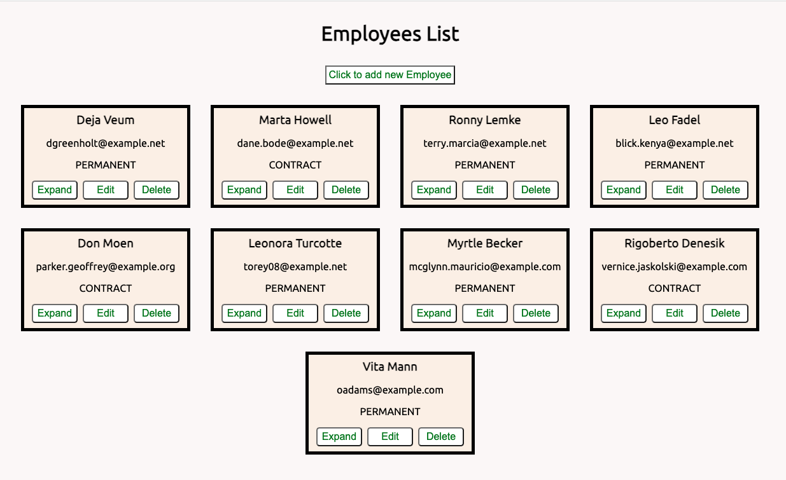
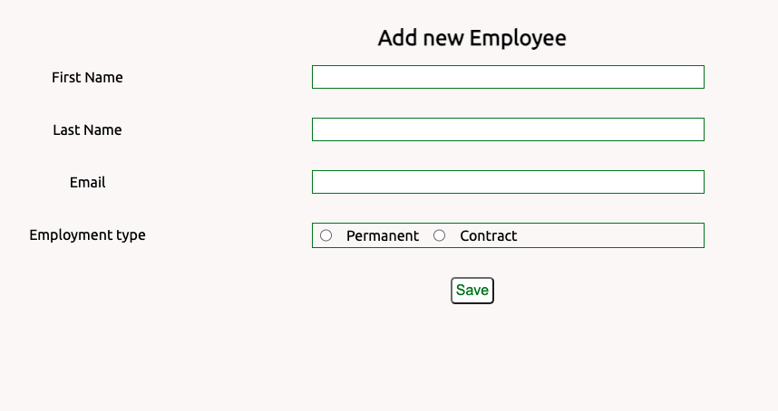

## Dependencies

# EMPLOYEE CREATOR APP (REACT + TYPESCRIPT)

## Demo




## Purpose

- The purpose of this project was to build frontend of Employee Creator App in React with Typescript which could then be connected with the Spring Boot backend.
- React was chosen as it is a powerful tool to build website. Typescript provides type safety.

## Dependencies

```bash
npm i @hookform/resolvers
```

```bash
npm i react-router-dom
```

```bash
npm i yup
```

```bash
npm i @hookform/resolvers
```

## Design Goals

- The goal was to create a React app that can provide a GUI to the spring boot backend and enable the user to perform CRUD operations on the database

## Features

- The landing page shows the list of all the emoloyees
- Each employee card has options for expand, edit and delete
- If a record is deleted in the database the page updates instantaneously without refreshing
- A single reusable Button component
- When create employee button is clicked it opens a form with yup validations
- Form is on a different page for which react-router-dom was used

## Future goals

- Make expand and edit buttons functional
